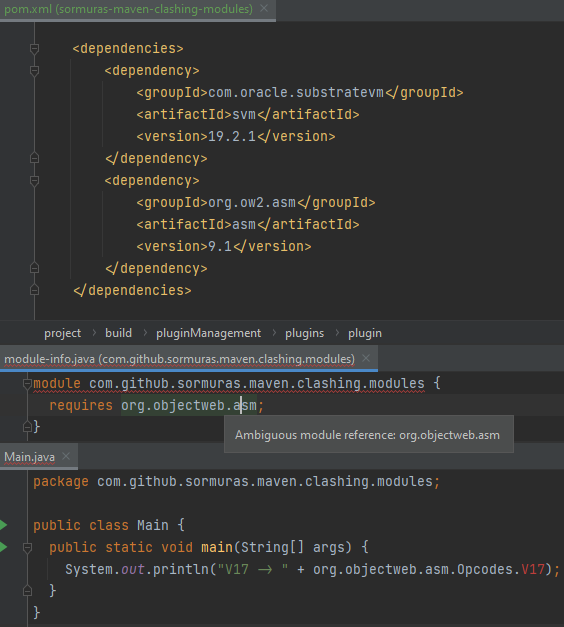

# maven-clashing-modules

Motivation:

- https://twitter.com/sormuras/status/1365197340215246848
- Or what are Impostor Modules published at Maven Central?
- Want more? 🧩 https://github.com/sormuras/modules

This Maven project has two dependencies:

- `com.oracle.substratevm:svm:19.2.1`
- `org.ow2.asm:asm:9.1`

Both identify as module `org.objectweb.asm` due to both contain a `module-info.class` in their JAR file's root.

If you comment out the first dependency, everything compiles and launches as expected.
